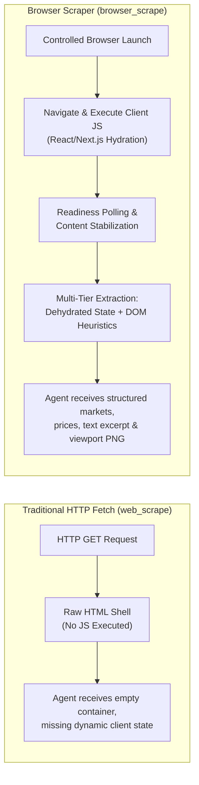
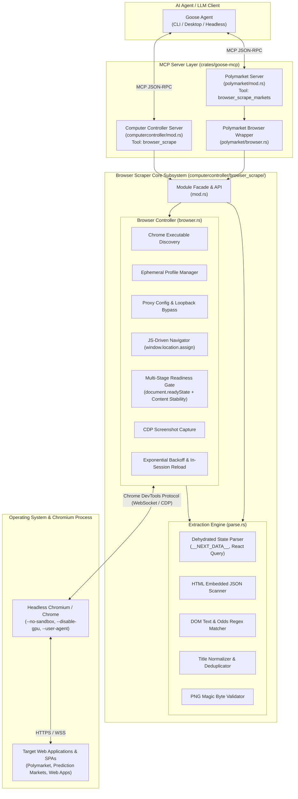
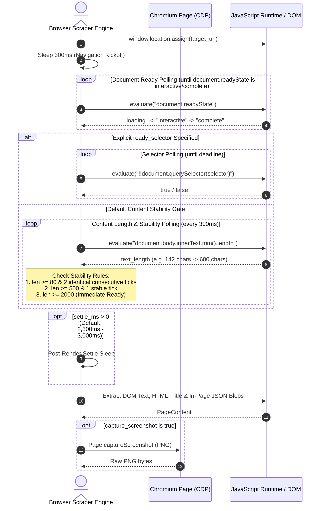
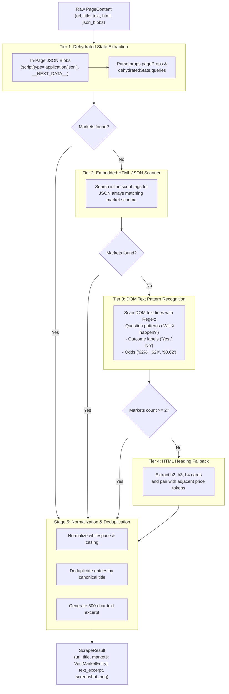
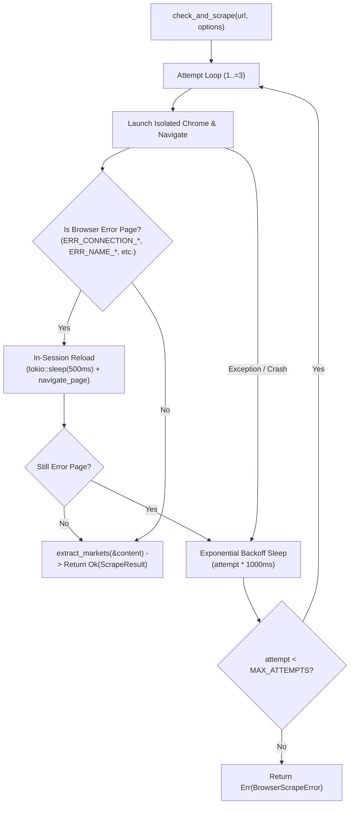

# Browser Scraper Detailed Design

This document details the architecture, browser lifecycle management, navigation and readiness heuristics, structured data extraction pipeline, resiliency mechanisms, and security model of the **Browser Scraper Subsystem** in Goose ([`crates/goose-mcp/src/computercontroller/browser_scrape/`](../../../crates/goose-mcp/src/computercontroller/browser_scrape/)).

---

## 1. Executive Summary & Motivation

Modern web platforms—particularly decentralized prediction markets like [Polymarket](https://polymarket.com), dynamic finance dashboards, and JavaScript-heavy Single Page Applications (SPAs)—rely on client-side rendering frameworks (React, Next.js, Vue, WebSockets). 

When AI agents query these sites using standard HTTP fetch (`web_scrape`), they typically receive empty HTML shell documents (`<div id="__next"></div>` or `<div id="root"></div>`) devoid of data.



### Core Design Objectives
1. **Full JavaScript Execution**: Drive a real Chromium/Chrome instance over the Chrome DevTools Protocol (CDP) to render SPAs authentically.
2. **Resilient Readiness Detection**: Bypass static sleep timers and rigid frame lifecycle timeouts in favor of dynamic DOM readiness, content length stabilization, and selector polling.
3. **Multi-Tier Structured Extraction**: Harvest structured market and event data from dehydrated JSON script tags (`__NEXT_DATA__`, React Query cache), HTML embeddings, and normalized DOM text heuristics.
4. **Multimodal Support**: Capture validated viewport PNG screenshots directly via CDP for vision-capable LLM reasoning.
5. **Zero Process Interference & Ephemeral Isolation**: Run with isolated temporary user profiles per session, avoiding profile locks, cookie leaks, and concurrent race conditions (`ERR_NETWORK_CHANGED`).
6. **Transparent Proxy Propagation**: Automatically detect and map environment proxy configurations (`HTTPS_PROXY`, `ALL_PROXY`) to Chromium while maintaining CDP loopback communication.

---

## 2. System Architecture

The Browser Scraper subsystem is built inside `crates/goose-mcp` using `chromiumoxide` for CDP protocol communication and is exposed through both the generic `computercontroller` MCP server and the specialized `polymarket` MCP server.



### Module Responsibilities

| Module | File Path | Core Responsibilities |
| :--- | :--- | :--- |
| **Facade** | [`mod.rs`](../../../crates/goose-mcp/src/computercontroller/browser_scrape/mod.rs) | Exposes public API: `check_and_scrape`, `navigate_and_extract`, `extract_markets`, `ScrapeOptions`, and `ScrapeResult`. |
| **Browser Controller** | [`browser.rs`](../../../crates/goose-mcp/src/computercontroller/browser_scrape/browser.rs) | Chrome discovery, ephemeral profile lifecycle, proxy detection, JS navigation, readiness polling, CDP communication, retry loop, screenshot capture. |
| **Parser Engine** | [`parse.rs`](../../../crates/goose-mcp/src/computercontroller/browser_scrape/parse.rs) | Pure, offline-testable data extraction: Next.js/React Query state extraction, regex-based odds parsing, title normalization, PNG signature validation. |
| **Polymarket Adapter** | [`polymarket/browser.rs`](../../../crates/goose-mcp/src/polymarket/browser.rs) | Normalizes Polymarket slugs to URLs, adapts `ScrapeResult` into strongly typed `MarketSummary` structs for market reasoning. |

---

## 3. Browser Lifecycle & Process Orchestration

### 3.1 Binary Discovery
The scraper automatically locates an installed Chromium or Google Chrome binary using a multi-step probe:
1. **Explicit Override**: Checks `options.chrome_path` if specified by configuration.
2. **PATH Search**: Probes `which` for standard binary names: `google-chrome`, `google-chrome-stable`, `chromium`, `chromium-browser`, `chrome`.
3. **Known OS Locations**: Fallback checks for standard Linux (`/usr/bin/google-chrome`, `/usr/bin/chromium`) and macOS (`/Applications/Google Chrome.app/Contents/MacOS/Google Chrome`) installation paths.

### 3.2 Ephemeral Session Isolation
To prevent cross-session pollution, lock contention on Chrome's SQLite database, and network race conditions (`ERR_NETWORK_CHANGED`), every scrape creates a fresh temporary user data directory:

```rust
let profile_dir = tempfile::tempdir().map_err(|e| {
    BrowserScrapeError::Launch(format!("failed to create chrome profile dir: {e}"))
})?;
```

The profile directory is held in memory for the duration of the browser lifecycle and cleanly dropped and deleted on session completion.

### 3.3 Chromium Launch Flags & Sandboxing

The browser is launched with minimal overhead flags tailored for headless server and container execution:

```rust
let mut builder = BrowserConfig::builder()
    .chrome_executable(&chrome)
    .window_size(1280, 900)
    .request_timeout(options.navigation_timeout)
    .user_data_dir(profile_dir.path())
    .arg("disable-dev-shm-usage")      // Avoid /dev/shm memory limits in Docker
    .arg("disable-gpu")                // Headless software rasterization
    .arg("disable-extensions")         // Clean execution profile
    .arg("no-first-run")               // Skip onboarding wizards
    .arg("no-default-browser-check")   // Skip default browser prompts
    .arg("disable-features=TranslateUI")
    .arg(("user-agent", "Mozilla/5.0 (X11; Linux x86_64) AppleWebKit/537.36 (KHTML, like Gecko) Chrome/120.0.0.0 Safari/537.36 GooseBrowserScrape/1.0"));

if options.no_sandbox {
    builder = builder.no_sandbox();    // Required in root/CI/Docker containers
}
```

### 3.4 Transparent Proxy Integration
Chrome does not automatically inherit environment variables like `http_proxy` / `https_proxy` on Linux. The controller reads `HTTPS_PROXY`, `HTTP_PROXY`, and `ALL_PROXY`, formatting them into `--proxy-server` while explicitly injecting `--proxy-bypass-list="<-loopback>"`:

```rust
if let Some(proxy) = detect_proxy_server() {
    builder = builder
        .arg(("proxy-server", proxy.as_str()))
        .arg(("proxy-bypass-list", "<-loopback>"));
}
```

> [!IMPORTANT]
> The `<-loopback>` bypass is critical: it ensures that Chromium's internal WebSocket connection over loopback (used by CDP) is never routed to the external proxy, which would cause immediate connection aborts.

---

## 4. Navigation & Readiness Architecture

### 4.1 Why JS-Driven Navigation Replaced `Page::goto`

Traditional CDP drivers utilize `Page.navigate` or `Page::goto` which hook into Chrome's `FrameNavigationRequest` event. Under slow network proxies or complex SPAs (such as Polymarket), first contentful paint frequently exceeds the library's hardcoded 30-second lifecycle timeout, resulting in unrecoverable `Navigation timed out` errors even when Chrome successfully finishes rendering seconds later.

The Browser Scraper decouples navigation triggering from readiness verification by executing JavaScript-driven navigation via `window.location.assign(...)` and polling readiness against a customizable timeout deadline (`navigation_timeout`):

```rust
let assign = format!(
    "window.location.assign({})",
    serde_json::to_string(url).unwrap_or_else(|_| format!("\"{url}\""))
);
page.evaluate(assign.as_str()).await?;
```

### 4.2 Multi-Stage Readiness Pipeline



### 4.3 Content Stability Rules
When no explicit CSS selector is provided, `wait_for_meaningful_content` monitors DOM body length over 300ms intervals:
- **Trivial Content Threshold**: Length `< 80` characters is treated as empty or pre-hydration shell.
- **Moderate Content**: Length between `80` and `499` characters requires **2 consecutive stable polling ticks** (length unchanged).
- **Rich Content**: Length between `500` and `1999` characters requires **1 stable polling tick**.
- **Heavy Content**: Length `>= 2000` characters completes immediately without waiting for further ticks.

### 4.4 Transient Context Handling
During client-side hydration and SPA route transitions, Chromium's JavaScript execution context is momentarily destroyed and recreated. Standard evaluations return errors like `"Execution context was destroyed"` or `"Cannot find context with specified id"`.

The readiness evaluator detects transient context errors via `is_transient_context_error` and continues polling rather than aborting:

```rust
fn is_transient_context_error(message: &str) -> bool {
    let m = message.to_ascii_lowercase();
    m.contains("cannot find context")
        || m.contains("execution context was destroyed")
        || m.contains("inspected target navigated or closed")
        || m.contains("session with given id not found")
        || m.contains("target closed")
}
```

---

## 5. Structured Data Extraction Engine

The extraction engine ([`parse.rs`](../../../crates/goose-mcp/src/computercontroller/browser_scrape/parse.rs)) is completely separated from the browser runtime. It takes a raw `PageContent` struct and executes a multi-tier fallback parser to reconstruct market questions, outcome labels, prices, and status.



### 5.1 Extracted Data Structures

```rust
#[derive(Debug, Clone, Serialize, Deserialize, PartialEq)]
pub struct MarketEntry {
    /// Market question / event title
    pub title: String,
    /// Associated prices or probabilities (e.g. ["0.62", "0.38"] or ["62%", "38%"])
    pub prices: Vec<String>,
    /// Optional market status (e.g. "active", "closed", "open")
    #[serde(skip_serializing_if = "Option::is_none")]
    pub status: Option<String>,
    /// Optional outcome labels (e.g. ["Yes", "No"])
    #[serde(default, skip_serializing_if = "Vec::is_empty")]
    pub outcomes: Vec<String>,
}

#[derive(Debug, Clone, Serialize, Deserialize, PartialEq)]
pub struct ScrapeResult {
    pub url: String,
    pub title: String,
    pub markets: Vec<MarketEntry>,
    pub text_excerpt: String,
    #[serde(skip)]
    pub screenshot_png: Option<Vec<u8>>,
}
```

---

## 6. Resiliency, Retries & Error Recovery

Network requests in headless automated environments are subject to transient connection resets, proxy interruptions, and DNS drops. The scraper implements a two-level recovery mechanism:



### Error Page Classification
`is_browser_error_page` inspects extracted DOM text to catch silent Chromium error pages:
- `err_connection_refused`, `err_connection_reset`, `err_connection_closed`
- `err_name_not_resolved` (DNS failures)
- `err_timed_out`
- Blank fallback screens with "This page couldn't load" or generic "Reload / Back" controls.

---

## 7. Multimodal Screenshot Pipeline

When `capture_screenshot: true` is requested, the controller issues a CDP `Page.captureScreenshot` command in PNG format:

```rust
async fn capture_page_png(page: &chromiumoxide::Page) -> Result<Vec<u8>, BrowserScrapeError> {
    let params = ScreenshotParams::builder()
        .format(CaptureScreenshotFormat::Png)
        .build();
    let bytes = page
        .screenshot(params)
        .await
        .map_err(|e| BrowserScrapeError::Protocol(format!("screenshot failed: {e}")))?;
    Ok(bytes)
}
```

### Binary Integrity Validation
To guarantee that corrupted buffers or truncated image streams are never returned to the LLM agent, all captured bytes are verified against the standard ISO/IEC 15948 PNG magic signature:

$$\text{Signature} = [0\text{x}89, \text{'P'}, \text{'N'}, \text{'G'}, 0\text{x}0\text{D}, 0\text{x}0\text{A}, 0\text{x}1\text{A}, 0\text{x}0\text{A}]$$

```rust
pub const PNG_SIGNATURE: &[u8] = &[0x89, b'P', b'N', b'G', 0x0D, 0x0A, 0x1A, 0x0A];

pub fn is_valid_png(bytes: &[u8]) -> bool {
    bytes.len() > 1024 && bytes.starts_with(PNG_SIGNATURE)
}
```

---

## 8. Polymarket Integration Adapter

The Polymarket MCP server wraps the core browser scraper to provide specialized market discovery:

```mermaid
flowchart LR
    Agent["Goose Agent"] -->|"browser_scrape_markets(slug='will-btc-hit-100k')"| Mod["polymarket/mod.rs"]
    Mod --> SlugHelper["market_url_from_slug()"]
    SlugHelper -->|"https://polymarket.com/event/will-btc-hit-100k"| BrowserRs["polymarket/browser.rs"]
    BrowserRs --> Core["computercontroller::check_and_scrape()"]
    Core --> ScrapeResult["ScrapeResult (MarketEntry items)"]
    ScrapeResult --> Converter["browser_entry_to_summary()"]
    Converter --> MarketSummary["MarketSummary items (YES/NO tokens, normalized volumes)"]
    MarketSummary --> ToolResult["MCP CallToolResult JSON + Optional Screenshot"]
    ToolResult --> Agent
```



### Slug Normalization Rules
The helper `market_url_from_slug` intelligently parses user inputs:
- Absolute URLs (`https://polymarket.com/...`) $\rightarrow$ passed unchanged.
- Paths (`event/slug`, `market/slug`) $\rightarrow$ prefixed with `https://polymarket.com/`.
- Bare slugs (`us-election-2024`) $\rightarrow$ resolved to `https://polymarket.com/event/us-election-2024`.

---

## 9. Tool Reference & Developer Interfaces

### 9.1 `computercontroller__browser_scrape` Tool
Available when `computercontroller` extension is enabled.

| Parameter | Type | Required | Default | Description |
| :--- | :--- | :--- | :--- | :--- |
| `url` | `String` | **Yes** | — | Web page URL to load in the controlled headless browser. |
| `settle_ms` | `u64` | No | `2000` | Extra wait time in milliseconds after ready condition for late JS rendering. |
| `ready_selector`| `String` | No | `None` | CSS selector that must be present before content extraction proceeds. |
| `timeout_secs` | `u64` | No | `45` | Maximum navigation and readiness wait time in seconds. |
| `save_output` | `bool` | No | `false`| Persist structured JSON output to the Computer Controller cache directory. |
| `capture_screenshot`| `bool` | No | `false`| Capture a viewport PNG and return it as image content in the MCP response. |

### 9.2 `polymarket__browser_scrape_markets` Tool
Available when `polymarket` extension is enabled.

| Parameter | Type | Required | Default | Description |
| :--- | :--- | :--- | :--- | :--- |
| `url` | `String` | No | `https://polymarket.com` | Specific market or event URL. |
| `slug` | `String` | No | `None` | Market or event slug (e.g. `"fed-rate-cut"`). |
| `settle_ms` | `u64` | No | `3000` | Settle time in milliseconds for market card rendering. |
| `timeout_secs` | `u64` | No | `45` | Navigation timeout in seconds. |
| `ready_selector`| `String` | No | `None` | Optional CSS selector. |
| `capture_screenshot`| `bool`| No | `false`| Include a base64/binary viewport screenshot. |

### 9.3 Standalone Developer CLI

Developers can execute and debug the browser scraping pipeline directly from the command line without launching a full Goose agent session:

```bash
# Basic scrape of an arbitrary web page
cargo run -p goose-mcp --example browser_scrape -- https://polymarket.com

# Scrape with custom timeout, settle delay, and screenshot output
cargo run -p goose-mcp --example browser_scrape -- \
  --settle-ms 3000 \
  --timeout-secs 90 \
  --screenshot /tmp/polymarket_viewport.png \
  https://polymarket.com/event/fed-interest-rates
```

---

## 10. Security & Non-Custodial Principles

1. **Read-Only Automated Surface**: The browser scraper is purely an extraction engine. It does not perform automated clicks, form fills, keystroke injections, or transaction signing.
2. **Ephemeral Privacy**: Session cookies, local storage, and cached network tokens are destroyed upon completion when the temporary profile directory is cleaned.
3. **No Private Key Ingestion**: Secret keys and wallet mnemonic phrases are never exposed to or processed by the browser automation environment.
4. **Isolated Memory Bounds**: Evaluated JavaScript executions are wrapped in timeout boundaries (max 8 seconds per expression) to prevent runaway scripts or denial-of-service via infinite loops in third-party pages.

---

## 11. Related Architecture Documentation

- [Polymarket MCP Detailed Design](./polymarket-mcp-design.md)
- [Extensions Framework Design](./extensions-design.md)
- [Computer Controller Extension User Guide](../mcp/computer-controller-mcp.md)
- [Polymarket Extension User Guide](../mcp/polymarket-mcp.md)
- [Browser Scraper Source Code](../../../crates/goose-mcp/src/computercontroller/browser_scrape/)
