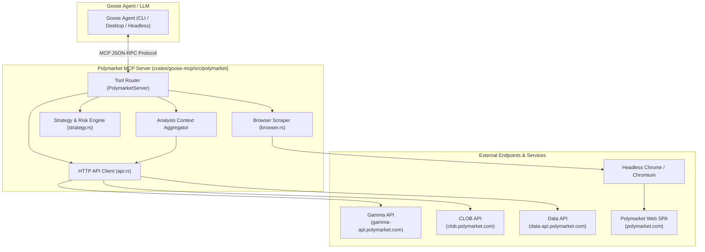
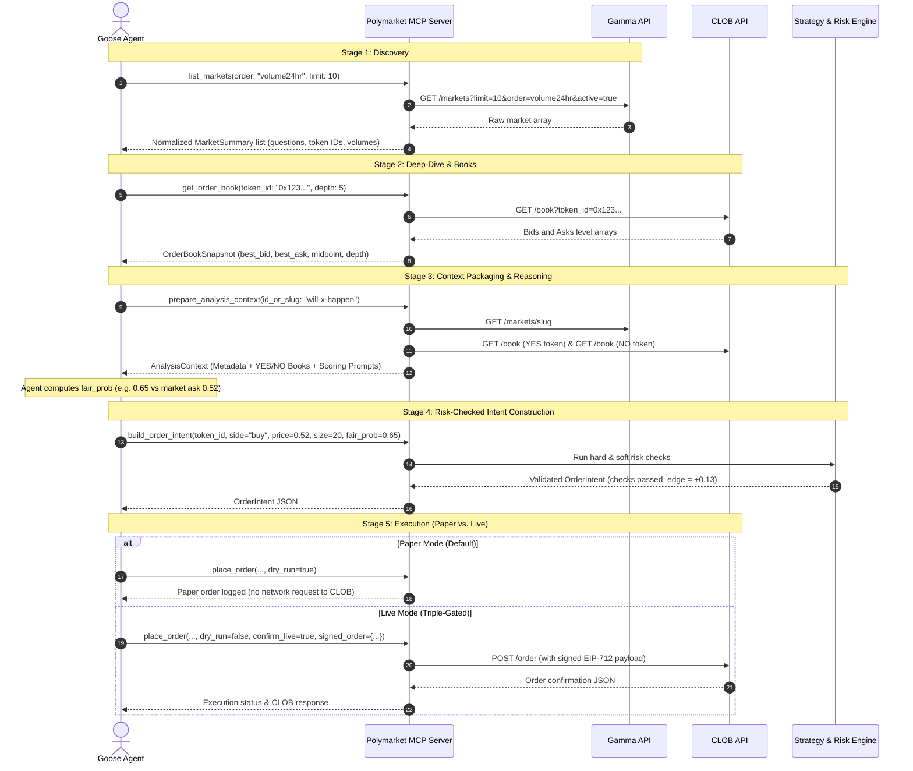
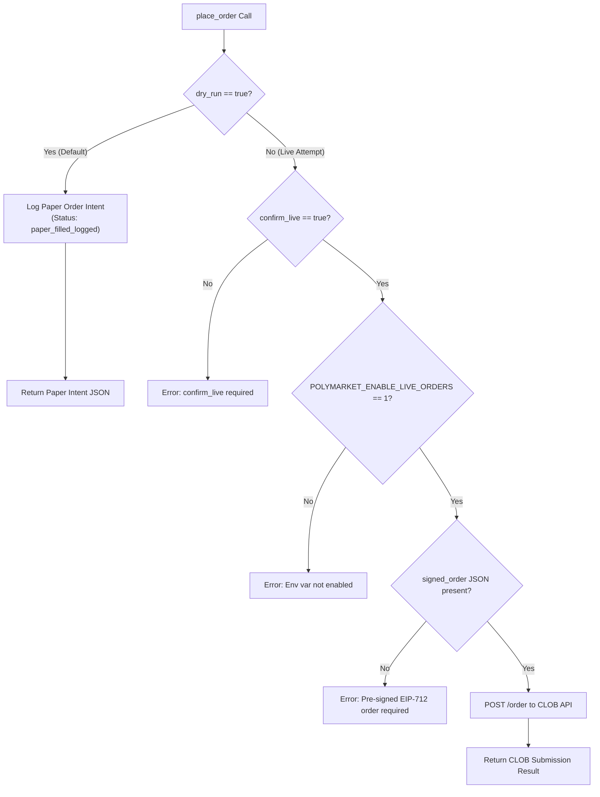

# Polymarket MCP Detailed Design

This document details the architecture, operational workflow, component design, risk control engine, and security model of the **Polymarket MCP Server** in Goose ([`crates/goose-mcp/src/polymarket/`](../../../crates/goose-mcp/src/polymarket/)).

---

## 1. Overview & Motivation

The **Polymarket MCP Server** provides AI agents in Goose with a structured interface to interact with [Polymarket](https://polymarket.com), the decentralized prediction market platform on Polygon.

### Core Objectives
1. **Market Discovery & Intelligence**: Efficiently search, list, filter, and extract liquid prediction markets and events.
2. **Real-Time Market Depth**: Provide low-latency access to the Central Limit Order Book (CLOB), order depths, bids/asks, and midpoints.
3. **Dual Data Paths**:
   - **API Path** (High-precision REST endpoints): Preferred for programmatic reasoning, trading data, and token IDs.
   - **Browser Path** (Headless Chrome): Used for visual layout verification, narrative context, and JavaScript SPA rendering.
4. **Context Packaging for LLM Reasoning**: Structure market metadata, resolution criteria, and YES/NO books into a unified payload for calibrated probability estimation.
5. **Paper-First Risk Engine & Non-Custodial Safety**: Enforce strict pre-trade risk checks with default paper execution. Live orders are triple-gated and strictly require external EIP-712 cryptographic signatures.

---

## 2. System Architecture

The Polymarket MCP server is implemented in Rust within `goose-mcp` using the `rmcp` protocol framework.



### Key Subsystems

| Module | Source File | Responsibilities |
| :--- | :--- | :--- |
| **Server & Router** | [`mod.rs`](../../../crates/goose-mcp/src/polymarket/mod.rs) | Defines MCP tool schemas, tool routing via `#[tool]`, input parsing, JSON serialization, and instructions. |
| **API Client** | [`api.rs`](../../../crates/goose-mcp/src/polymarket/api.rs) | Asynchronous `reqwest` client for Gamma (markets/search), CLOB (books/prices/orders), and Data API (positions). |
| **Strategy & Risk** | [`strategy.rs`](../../../crates/goose-mcp/src/polymarket/strategy.rs) | Hard & soft pre-trade risk checks, edge calculation against LLM `fair_prob`, and `OrderIntent` construction. |
| **Browser Scraper** | [`browser.rs`](../../../crates/goose-mcp/src/polymarket/browser.rs) | Headless Chrome driver via Goose's `computercontroller` subsystem ([Design Doc](./browser-scraper-design.md)) to render SPAs and extract DOM market cards / screenshots. |
| **Type Definitions** | [`types.rs`](../../../crates/goose-mcp/src/polymarket/types.rs) | Strongly typed representations of markets, order books, positions, intents, and risk limits. |

---

## 3. End-to-End Operational Lifecycle

The typical agent lifecycle comprises five sequential stages:



---

## 4. Detailed Component Design

### 4.1 REST API Integration ([`api.rs`](../../../crates/goose-mcp/src/polymarket/api.rs))

The API layer interfaces with three primary Polymarket endpoints:

1. **Gamma API (`https://gamma-api.polymarket.com`)**:
   - `GET /markets`: Queries markets with pagination, sorting (`volume24hr`, `liquidity`, `endDate`), and tag filters.
   - `GET /events`: Queries event groups containing multi-outcome or related markets.
   - `GET /public-search`: Full-text fuzzy search across event titles, tags, and profiles.
2. **CLOB API (`https://clob.polymarket.com`)**:
   - `GET /book?token_id=...`: Retrieves bids and asks. Normalized to sort bids descending and asks ascending.
   - `GET /price?token_id=...&side=...`: Fetches direct price quote.
   - `GET /midpoint?token_id=...`: Computes or retrieves order book midpoint.
   - `POST /order`: Submits pre-signed EIP-712 orders (optionally with API Key/Secret/Passphrase headers).
3. **Data API (`https://data-api.polymarket.com`)**:
   - `GET /positions?user=0x...`: Public endpoint retrieving active open positions and PnL for any EVM wallet address.

---

### 4.2 Browser Scraping Subsystem ([`browser.rs`](../../../crates/goose-mcp/src/polymarket/browser.rs))

For dynamic single-page applications (SPAs) where raw HTTP GET returns an empty shell, `browser_scrape_markets` utilizes the shared headless Chrome subsystem ([`computercontroller::browser_scrape`](../../../crates/goose-mcp/src/computercontroller/browser_scrape/)):
- **Process Orchestration**: Launches an isolated Chromium/Chrome instance via CDP with ephemeral user profile directories (`tempdir`), custom user-agent, and transparent proxy forwarding with loopback bypass.
- **Slug Normalization**: Converts bare slugs (e.g., `us-election-2024` or `event/fed-rate-cut`) into full Polymarket URLs via `market_url_from_slug`.
- **JS-Driven Navigation & Readiness Gate**: Initiates navigation with `window.location.assign` and polls `document.readyState` and DOM content length stability thresholds or explicit `ready_selector`.
- **Multi-Tier Extraction**: Extracts structured market cards, outcome probabilities, and question titles by parsing in-page JSON blobs (`__NEXT_DATA__`, React Query cache), HTML embedded scripts, and DOM text heuristics.
- **Multimodal Screenshots**: Optionally captures a validated viewport PNG screenshot via CDP and returns it as image content for vision-capable models.

> [!NOTE]
> For the complete architectural and engineering specification of the browser scraping engine, see the dedicated [Browser Scraper Detailed Design](./browser-scraper-design.md).

---

### 4.3 Strategy & Risk Engine ([`strategy.rs`](../../../crates/goose-mcp/src/polymarket/strategy.rs))

All order generation passes through a unified risk verification engine before an `OrderIntent` can be constructed.

#### Risk Check Definitions:

```rust
pub struct RiskLimits {
    pub max_notional_usdc: f64, // Default: $25.00 USDC
    pub min_edge: f64,          // Default: 0.02 (2% required expected value edge)
    pub max_buy_price: f64,     // Default: 0.98 (Prevents buying extreme tails)
    pub min_sell_price: f64,    // Default: 0.02 (Prevents selling extreme tails)
    pub min_size: f64,          // Default: 1.0 share
}
```

#### Validation Rules:
1. **Price Unit Interval**: `0.0 <= price <= 1.0`.
2. **Size Floor**: `size >= min_size`.
3. **Notional Cap**: `(price * size) <= max_notional_usdc` (enforces strict maximum capital at risk per order).
4. **Boundary Guardrails**: `buy_price <= max_buy_price` and `sell_price >= min_sell_price`.
5. **Token ID Check**: Ensures non-empty, valid hex/decimal identifier.
6. **Expected Value Edge Check**:
   - For Buy orders: `edge = fair_prob - limit_price >= min_edge`.
   - For Sell orders: `edge = limit_price - fair_prob >= min_edge`.
   - If edge is negative or below threshold, the intent construction fails.

---

### 4.4 Order Execution & Security Architecture



#### Security Model Principles:
- **No Private Keys in Process**: Goose never ingests, stores, or manages Ethereum/Polygon private keys.
- **External Signing**: Live orders must be generated and signed via Polymarket's official SDKs ([`py-clob-client`](https://github.com/Polymarket/py-clob-client) or TypeScript SDK) using standard EIP-712 structured typed data.
- **Fail-Safe Defaults**: `dry_run` defaults to `true`. Live order placement cannot be triggered accidentally by the agent.

---

## 5. Tool Reference Specification

| Tool Name | Parameters | Returns | Primary Source |
| :--- | :--- | :--- | :--- |
| `list_markets` | `limit`, `offset`, `active`, `closed`, `order`, `ascending`, `tag_id` | Normalized summaries with market questions, volumes, liquidity, and token IDs | Gamma API |
| `list_events` | `limit`, `offset`, `active`, `closed`, `order`, `ascending` | Grouped event entities with nested markets | Gamma API |
| `get_market` | `id_or_slug` | Detailed market object including resolution rules and `clob_token_ids` | Gamma API |
| `search` | `query`, `limit_per_type` | Matching events, tags, and profiles | Gamma API |
| `get_order_book` | `token_id`, `depth` | Order book levels (bids/asks), best bid, best ask, midpoint | CLOB API |
| `get_price` | `token_id`, `side`, `include_midpoint` | Execution price quote and midpoint | CLOB API |
| `get_positions` | `user` (0x wallet address) | Portfolio positions, sizes, and unrealized metrics | Data API |
| `browser_scrape_markets` | `url`, `slug`, `settle_ms`, `timeout_secs`, `ready_selector`, `capture_screenshot` | Extracted market titles/prices from DOM and optional PNG screenshot | Headless Chrome |
| `prepare_analysis_context` | `id_or_slug`, `include_books`, `book_depth` | Unified `AnalysisContext` JSON containing market info, YES/NO books, and scoring instructions | Aggregate API |
| `build_order_intent` | `token_id`, `side`, `price`, `size`, `order_type`, `fair_prob`, `limits...` | Risk-validated paper `OrderIntent` | Local Strategy Engine |
| `place_order` | `token_id`, `side`, `price`, `size`, `dry_run`, `confirm_live`, `signed_order`, `limits...` | Paper simulation record or CLOB live submission response | Local / CLOB API |

---

## 6. Configuration & Setup

### Enabling the Extension in Goose

#### 1. Goose CLI Session
```bash
# Launch interactive session with Polymarket enabled
goose session --with-builtin polymarket
```

#### 2. Goose CLI One-Shot Command
```bash
goose run --with-builtin polymarket -t "List top 5 Polymarket markets by 24h volume and prepare analysis context for the first"
```

#### 3. Standalone MCP Server Process
```bash
goose mcp polymarket
```

#### 4. Environment Variables
- `POLYMARKET_ENABLE_LIVE_ORDERS=1`: Required for non-dry-run order placement.
- `POLYMARKET_API_KEY`: (Optional) Level 2 API key for authenticated CLOB operations.
- `POLYMARKET_API_SECRET`: (Optional) Level 2 API secret.
- `POLYMARKET_API_PASSPHRASE`: (Optional) Level 2 API passphrase.

---

## 7. Related References

- [Polymarket MCP User Documentation](../mcp/polymarket-mcp.md)
- [Browser Scraper Detailed Design](./browser-scraper-design.md)
- [Computer Controller User Documentation](../mcp/computer-controller-mcp.md)
- [Polymarket Implementation Source Code](../../../crates/goose-mcp/src/polymarket/)
- [Extensions Architecture Design](./extensions-design.md)
- [Official Polymarket Documentation](https://docs.polymarket.com/)
